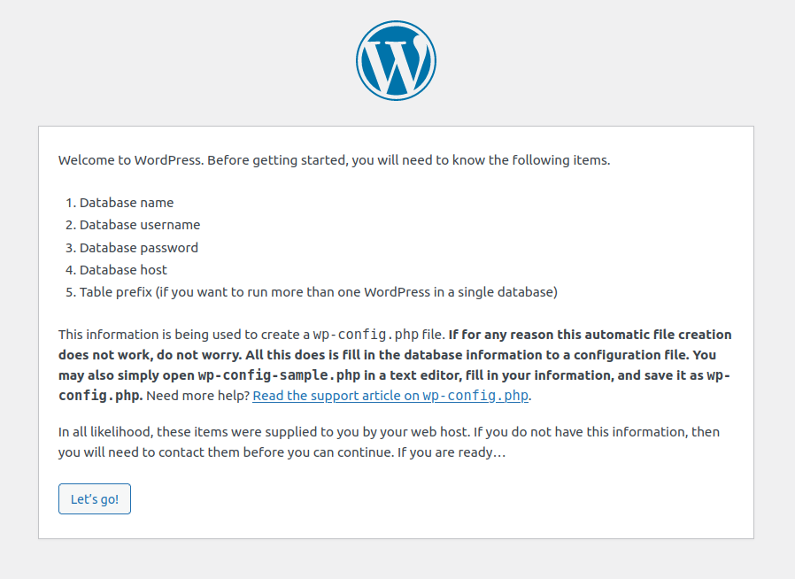

Install Wordpress
=================

see `How to install WordPress <https://wordpress.org/support/article/how-to-install-wordpress/>`_.

Start with an Ubuntu server running Apache2 and PHP and with a domain protected with a Let's Encrypt certificate so that https can be used (see `Ubuntu Server Configuration <https://stevespages.org.uk/codenotes/ubuntuserverconfig.html>`_). Also make sure you can connect to the server using SSH (see `SSH <https://stevespages.org.uk/codenotes/ssh.html>`_)

Create a directory from which the website will be served for example:

.. code-block:: console
   :caption: create directory for wordpress

   ubuntu@ip-172-31-32-80:/var/www/stevespages.org.uk/public_html$ mkdir wp

Now update, upgrade and then install MariaDB (See `Digital Ocean guide to installing MariaDB on Ubuntu <https://https://www.digitalocean.com/community/tutorials/how-to-install-mariadb-on-ubuntu-22-04>`_)

.. code-block:: console
   :caption: install MariaDB

   ubuntu@ip-172-31-32-80:/var/www/stevespages.org.uk/public_html$ sudo apt-get update
   Hit:1 http://eu-west-2.ec2.archive.ubuntu.com/ubuntu jammy InRelease
   etc. etc. etc.
   ubuntu@ip-172-31-32-80:/var/www/stevespages.org.uk/public_html$ sudo apt-get upgrade
   Reading package lists... Done
   etc. etc. etc.
   ubuntu@ip-172-31-32-80:/var/www/stevespages.org.uk/public_html$ sudo apt-get install mariadb-server
   Reading package lists... Done

Now run the included mysql_secure_installation security script:

.. code-block:: console
   :caption: Run MariaDB security script

   ubuntu@ip-172-31-32-80:/var/www/stevespages.org.uk/public_html$ sudo mysql_secure_installation 
   
   NOTE: RUNNING ALL PARTS OF THIS SCRIPT IS RECOMMENDED FOR ALL MariaDB
         SERVERS IN PRODUCTION USE!  PLEASE READ EACH STEP CAREFULLY!
   
   In order to log into MariaDB to secure it, we'll need the current
   password for the root user. If you've just installed MariaDB, and
   haven't set the root password yet, you should just press enter here.
   
   Enter current password for root (enter for none): 
   OK, successfully used password, moving on...
   
   Setting the root password or using the unix_socket ensures that nobody
   can log into the MariaDB root user without the proper authorisation.
   
   You already have your root account protected, so you can safely answer 'n'.
   
   Switch to unix_socket authentication [Y/n] n
    ... skipping.
   
   You already have your root account protected, so you can safely answer 'n'.
   
   Change the root password? [Y/n] n
    ... skipping.
   
   By default, a MariaDB installation has an anonymous user, allowing anyone
   to log into MariaDB without having to have a user account created for
   them.  This is intended only for testing, and to make the installation
   go a bit smoother.  You should remove them before moving into a
   production environment.
   
   Remove anonymous users? [Y/n] Y
    ... Success!
   
   Normally, root should only be allowed to connect from 'localhost'.  This
   ensures that someone cannot guess at the root password from the network.
   
   Disallow root login remotely? [Y/n] Y
    ... Success!
   
   By default, MariaDB comes with a database named 'test' that anyone can
   access.  This is also intended only for testing, and should be removed
   before moving into a production environment.
   
   Remove test database and access to it? [Y/n] Y
    - Dropping test database...
    ... Success!
    - Removing privileges on test database...
    ... Success!
   
   Reloading the privilege tables will ensure that all changes made so far
   will take effect immediately.
   
   Reload privilege tables now? [Y/n] Y
    ... Success!
   
   Cleaning up...
   
   All done!  If you've completed all of the above steps, your MariaDB
   installation should now be secure.
   
   Thanks for using MariaDB!
   ubuntu@ip-172-31-32-80:/var/www/stevespages.org.uk/public_html$

Create a database for wordpress to use. I will call the database `wp`:

.. code-block:: console
   :caption: create a MariaDB database

   ubuntu@ip-172-31-32-80:/var/www/stevespages.org.uk/public_html$ sudo mariadb
   Welcome to the MariaDB monitor.  Commands end with ; or \g.
   Your MariaDB connection id is 37
   Server version: 10.6.11-MariaDB-0ubuntu0.22.04.1 Ubuntu 22.04
   
   Copyright (c) 2000, 2018, Oracle, MariaDB Corporation Ab and others.
   
   Type 'help;' or '\h' for help. Type '\c' to clear the current input statement.
   
   MariaDB [(none)]> CREATE DATABASE wp;
   Query OK, 1 row affected (0.000 sec)
   
   MariaDB [(none)]>

Continue with the MariaDB session to  create a user and password for Wordpress to use and also grant privileges to the user (probably best not to use quote marks in the password as you may put these around the password):

.. code-block:: console
   :caption: create a MariaDB database

   ubuntu@ip-172-31-32-80:/var/www/stevespages.org.uk/public_html$ sudo mariadb
   Welcome to the MariaDB monitor.  Commands end with ; or \g.
   Your MariaDB connection id is 37
   Server version: 10.6.11-MariaDB-0ubuntu0.22.04.1 Ubuntu 22.04
   
   Copyright (c) 2000, 2018, Oracle, MariaDB Corporation Ab and others.
   
   Type 'help;' or '\h' for help. Type '\c' to clear the current input statement.
   
   MariaDB [(none)]> CREATE DATABASE wp;
   Query OK, 1 row affected (0.000 sec)
   
   MariaDB [(none)]> GRANT ALL ON wp.* TO 'wpuser'@'localhost' IDENTIFIED BY '***' WITH GRANT OPTION;
   Query OK, 0 rows affected (0.001 sec)
   
   MariaDB [(none)]> exit
   Bye
   ubuntu@ip-172-31-32-80:/var/www/stevespages.org.uk/public_html$

In the last step I should have flushed the privileges to make the changes available in the current session (possibly closing and restarting MariaDB may have done this but I will do it anyway):

.. code-block:: console
   :caption: Flush privileges

   ubuntu@ip-172-31-32-80:/var/www/stevespages.org.uk/public_html$ sudo mariadb
   Welcome to the MariaDB monitor.  Commands end with ; or \g.
   Your MariaDB connection id is 38
   Server version: 10.6.11-MariaDB-0ubuntu0.22.04.1 Ubuntu 22.04
   
   Copyright (c) 2000, 2018, Oracle, MariaDB Corporation Ab and others.
   
   Type 'help;' or '\h' for help. Type '\c' to clear the current input statement.
   
   MariaDB [(none)]> FLUSH PRIVILEGES;
   Query OK, 0 rows affected (0.000 sec)
   
   MariaDB [(none)]> exit
   Bye
   ubuntu@ip-172-31-32-80:/var/www/stevespages.org.uk/public_html$

Now check that you can log into MariaDB as user, `wpuser`, with the password you used. In this session I first change the password for `wpuser` to get rid of the pesky quote mark. That is done as MariaDB root user. Then I exit and log back in as `wpuser`:

.. code-block:: console
   :caption: Log in as non-root user

   ubuntu@ip-172-31-32-80:/var/www/stevespages.org.uk/public_html$ sudo mariadb
   Welcome to the MariaDB monitor.  Commands end with ; or \g.
   Your MariaDB connection id is 40
   Server version: 10.6.11-MariaDB-0ubuntu0.22.04.1 Ubuntu 22.04
   
   Copyright (c) 2000, 2018, Oracle, MariaDB Corporation Ab and others.
   
   Type 'help;' or '\h' for help. Type '\c' to clear the current input statement.
   
   MariaDB [(none)]> ALTER USER 'wpuser'@'localhost' IDENTIFIED BY 'Ws7h%q97';
   Query OK, 0 rows affected (0.001 sec)
   
   MariaDB [(none)]> exit
   Bye
   ubuntu@ip-172-31-32-80:/var/www/stevespages.org.uk/public_html$ mariadb -u "wpuser" -p
   Enter password: 
   Welcome to the MariaDB monitor.  Commands end with ; or \g.
   Your MariaDB connection id is 41
   Server version: 10.6.11-MariaDB-0ubuntu0.22.04.1 Ubuntu 22.04
   
   Copyright (c) 2000, 2018, Oracle, MariaDB Corporation Ab and others.
   
   Type 'help;' or '\h' for help. Type '\c' to clear the current input statement.
   
   MariaDB [(none)]> SHOW DATABASES;
   +--------------------+
   | Database           |
   +--------------------+
   | information_schema |
   | wp                 |
   +--------------------+
   2 rows in set (0.000 sec)
   
   MariaDB [(none)]> SHOW GRANTS;
   +---------------------------------------------------------------------------------------------------------------+
   | Grants for wpuser@localhost                                                                                   |
   +---------------------------------------------------------------------------------------------------------------+
   | GRANT USAGE ON *.* TO `wpuser`@`localhost` IDENTIFIED BY PASSWORD '<long char string (not wpuser's password)>' |
   | GRANT ALL PRIVILEGES ON `wp`.* TO `wpuser`@`localhost` WITH GRANT OPTION                                      |
   +---------------------------------------------------------------------------------------------------------------+
   2 rows in set (0.000 sec)
   
   MariaDB [(none)]> exit
   Bye
   ubuntu@ip-172-31-32-80:/var/www/stevespages.org.uk/public_html$

Download Wordpress
------------------

We will download Wordpress directly into the directory we want to run it from. We will uncompress it and then get the contents of the Wordpress directory directly into the directory we want it to run from. We will delete the actual `wordpress` directory.

.. code-block:: console
   :caption: Download wordpress

   ubuntu@ip-172-31-32-80:/var/www/stevespages.org.uk/public_html$ cd wp
   ubuntu@ip-172-31-32-80:/var/www/stevespages.org.uk/public_html/wp$ wget https://wordpress.org/latest.tar.gz
   --2023-01-06 18:05:33--  https://wordpress.org/latest.tar.gz
   Resolving wordpress.org (wordpress.org)... 198.143.164.252
   Connecting to wordpress.org (wordpress.org)|198.143.164.252|:443... connected.
   HTTP request sent, awaiting response... 200 OK
   Length: 22751086 (22M) [application/octet-stream]
   Saving to: ‘latest.tar.gz’
   
   latest.tar.gz             100%[==================================>]  21.70M  10.8MB/s    in 2.0s    
   
   2023-01-06 18:05:36 (10.8 MB/s) - ‘latest.tar.gz’ saved [22751086/22751086]
   
   ubuntu@ip-172-31-32-80:/var/www/stevespages.org.uk/public_html/wp$ ls -la
   total 22228
   drwxrwxr-x  2 ubuntu ubuntu     4096 Jan  6 18:05 .
   drwxrwxr-x 42 ubuntu ubuntu     4096 Jan  6 17:15 ..
   -rw-rw-r--  1 ubuntu ubuntu 22751086 Nov 15 19:04 latest.tar.gz
   ubuntu@ip-172-31-32-80:/var/www/stevespages.org.uk/public_html/wp$ tar -xzvf latest.tar.gz
   wordpress/
   wordpress/xmlrpc.php
   etc.
   etc.
   etc.
   wordpress/wp-comments-post.php
   ubuntu@ip-172-31-32-80:/var/www/stevespages.org.uk/public_html/wp$ ls -la
   total 22232
   drwxrwxr-x  3 ubuntu ubuntu     4096 Jan  6 18:06 .
   drwxrwxr-x 42 ubuntu ubuntu     4096 Jan  6 17:15 ..
   -rw-rw-r--  1 ubuntu ubuntu 22751086 Nov 15 19:04 latest.tar.gz
   drwxr-xr-x  5 ubuntu ubuntu     4096 Nov 15 19:03 wordpress
   ubuntu@ip-172-31-32-80:/var/www/stevespages.org.uk/public_html/wp$ mv wordpress/* .
   ubuntu@ip-172-31-32-80:/var/www/stevespages.org.uk/public_html/wp$ ls -la
   total 22456
   drwxrwxr-x  6 ubuntu ubuntu     4096 Jan  6 18:06 .
   drwxrwxr-x 42 ubuntu ubuntu     4096 Jan  6 17:15 ..
   -rw-r--r--  1 ubuntu ubuntu      405 Feb  6  2020 index.php
   -rw-rw-r--  1 ubuntu ubuntu 22751086 Nov 15 19:04 latest.tar.gz
   -rw-r--r--  1 ubuntu ubuntu    19915 Jan  1  2022 license.txt
   -rw-r--r--  1 ubuntu ubuntu     7389 Sep 16 22:27 readme.html
   drwxr-xr-x  2 ubuntu ubuntu     4096 Jan  6 18:06 wordpress
   -rw-r--r--  1 ubuntu ubuntu     7205 Sep 16 23:13 wp-activate.php
   drwxr-xr-x  9 ubuntu ubuntu     4096 Nov 15 19:03 wp-admin
   -rw-r--r--  1 ubuntu ubuntu      351 Feb  6  2020 wp-blog-header.php
   -rw-r--r--  1 ubuntu ubuntu     2338 Nov  9  2021 wp-comments-post.php
   -rw-r--r--  1 ubuntu ubuntu     3001 Dec 14  2021 wp-config-sample.php
   drwxr-xr-x  4 ubuntu ubuntu     4096 Nov 15 19:03 wp-content
   -rw-r--r--  1 ubuntu ubuntu     5543 Sep 20 15:44 wp-cron.php
   drwxr-xr-x 27 ubuntu ubuntu    12288 Nov 15 19:03 wp-includes
   -rw-r--r--  1 ubuntu ubuntu     2494 Mar 19  2022 wp-links-opml.php
   -rw-r--r--  1 ubuntu ubuntu     3985 Sep 19 08:59 wp-load.php
   -rw-r--r--  1 ubuntu ubuntu    49135 Sep 19 22:26 wp-login.php
   -rw-r--r--  1 ubuntu ubuntu     8522 Oct 17 11:06 wp-mail.php
   -rw-r--r--  1 ubuntu ubuntu    24587 Sep 26 10:17 wp-settings.php
   -rw-r--r--  1 ubuntu ubuntu    34350 Sep 17 00:35 wp-signup.php
   -rw-r--r--  1 ubuntu ubuntu     4914 Oct 17 11:22 wp-trackback.php
   -rw-r--r--  1 ubuntu ubuntu     3236 Jun  8  2020 xmlrpc.php
   ubuntu@ip-172-31-32-80:/var/www/stevespages.org.uk/public_html/wp$ ls -la wordpress/
   total 8
   drwxr-xr-x 2 ubuntu ubuntu 4096 Jan  6 18:06 .
   drwxrwxr-x 6 ubuntu ubuntu 4096 Jan  6 18:06 ..
   ubuntu@ip-172-31-32-80:/var/www/stevespages.org.uk/public_html/wp$ rm -r latest.tar.gz wordpress/
   ubuntu@ip-172-31-32-80:/var/www/stevespages.org.uk/public_html/wp$ ls -la
   total 232
   drwxrwxr-x  5 ubuntu ubuntu  4096 Jan  6 18:06 .
   drwxrwxr-x 42 ubuntu ubuntu  4096 Jan  6 17:15 ..
   -rw-r--r--  1 ubuntu ubuntu   405 Feb  6  2020 index.php
   -rw-r--r--  1 ubuntu ubuntu 19915 Jan  1  2022 license.txt
   -rw-r--r--  1 ubuntu ubuntu  7389 Sep 16 22:27 readme.html
   -rw-r--r--  1 ubuntu ubuntu  7205 Sep 16 23:13 wp-activate.php
   drwxr-xr-x  9 ubuntu ubuntu  4096 Nov 15 19:03 wp-admin
   -rw-r--r--  1 ubuntu ubuntu   351 Feb  6  2020 wp-blog-header.php
   -rw-r--r--  1 ubuntu ubuntu  2338 Nov  9  2021 wp-comments-post.php
   -rw-r--r--  1 ubuntu ubuntu  3001 Dec 14  2021 wp-config-sample.php
   drwxr-xr-x  4 ubuntu ubuntu  4096 Nov 15 19:03 wp-content
   -rw-r--r--  1 ubuntu ubuntu  5543 Sep 20 15:44 wp-cron.php
   drwxr-xr-x 27 ubuntu ubuntu 12288 Nov 15 19:03 wp-includes
   -rw-r--r--  1 ubuntu ubuntu  2494 Mar 19  2022 wp-links-opml.php
   -rw-r--r--  1 ubuntu ubuntu  3985 Sep 19 08:59 wp-load.php
   -rw-r--r--  1 ubuntu ubuntu 49135 Sep 19 22:26 wp-login.php
   -rw-r--r--  1 ubuntu ubuntu  8522 Oct 17 11:06 wp-mail.php
   -rw-r--r--  1 ubuntu ubuntu 24587 Sep 26 10:17 wp-settings.php
   -rw-r--r--  1 ubuntu ubuntu 34350 Sep 17 00:35 wp-signup.php
   -rw-r--r--  1 ubuntu ubuntu  4914 Oct 17 11:22 wp-trackback.php
   -rw-r--r--  1 ubuntu ubuntu  3236 Jun  8  2020 xmlrpc.php
   ubuntu@ip-172-31-32-80:/var/www/stevespages.org.uk/public_html/wp$ 

Install MySQL / MySQLi PHP Extension
------------------------------------

Currently neither of these extensions is installed as revealed by examining the output of running the PHP command, `phpinfo()`, on the server and looking at the output in a browser. No mention of `mysql` (other than in the authors section) appears.

I am not sure which of these is required although it may be that installing either gives the same result. Here we will install `php-mysqli` (Infact there is a line in the response to the command below which reads ``Note, selecting 'php8.1-mysql' instead of 'php-mysqli'``):

.. code-block:: console
   :caption: Install php-mysql

   ubuntu@ip-172-31-32-80:/var/www/stevespages.org.uk/public_html/wp$ sudo apt-get install php-mysqli
   Reading package lists... Done
   Building dependency tree... Done
   Reading state information... Done
   Note, selecting 'php8.1-mysql' instead of 'php-mysqli'
   The following packages were automatically installed and are no longer required:
     libflashrom1 libftdi1-2
   Use 'sudo apt autoremove' to remove them.
   The following NEW packages will be installed:
     php8.1-mysql
   0 upgraded, 1 newly installed, 0 to remove and 10 not upgraded.
   Need to get 130 kB of archives.
   After this operation, 462 kB of additional disk space will be used.
   Get:1 http://eu-west-2.ec2.archive.ubuntu.com/ubuntu jammy-updates/main amd64 php8.1-mysql amd64 8.1.2-1ubuntu2.9 [130 kB]
   Fetched 130 kB in 0s (1577 kB/s) 
   Selecting previously unselected package php8.1-mysql.
   (Reading database ... 123422 files and directories currently installed.)
   Preparing to unpack .../php8.1-mysql_8.1.2-1ubuntu2.9_amd64.deb ...
   Unpacking php8.1-mysql (8.1.2-1ubuntu2.9) ...
   Setting up php8.1-mysql (8.1.2-1ubuntu2.9) ...
   
   Creating config file /etc/php/8.1/mods-available/mysqlnd.ini with new version
   
   Creating config file /etc/php/8.1/mods-available/mysqli.ini with new version
   
   Creating config file /etc/php/8.1/mods-available/pdo_mysql.ini with new version
   Processing triggers for libapache2-mod-php8.1 (8.1.2-1ubuntu2.9) ...
   Processing triggers for php8.1-cli (8.1.2-1ubuntu2.9) ...
   Scanning processes...                                                                                
   Scanning linux images...                                                                             
   
   Running kernel seems to be up-to-date.
   
   No services need to be restarted.
   
   No containers need to be restarted.
   
   No user sessions are running outdated binaries.
   
   No VM guests are running outdated hypervisor (qemu) binaries on this host.
   ubuntu@ip-172-31-32-80:/var/www/stevespages.org.uk/public_html/wp$ 

After running this ``phpinfo()`` still does not reveal a `mysql` section. We need to restart apache:

.. code-block:: console
   :caption: Restart apache

   ubuntu@ip-172-31-32-80:/var/www/stevespages.org.uk/public_html/wp$ sudo systemctl restart apache2
   ubuntu@ip-172-31-32-80:/var/www/stevespages.org.uk/public_html/wp$ 

Now apache has been restarted we see a `mysqli` section in the output of the ``phpinfo()`` command.

Run The WordPress Installation Script
-------------------------------------

There is an option to create a `wp-config.php` file from a generic `wp-config-sample.php` file. However as this is optional I will omit it. The file will be generated automatically. To run the installation script browse to the directory that WordPress was installed into. In this case that is at `https://stevespages.org.uk/wp`. The resulting web page looked like this:

The next page enabled me to enter user name, password etc into a form but on submitting the form I was informed that the `wp-config.php` file could not be created automatically. The contents of the file were available to copy from the web page and paste into a `wp-config.php` I created in the `wp` directory on the server. Continuing led to another form asking for Site Title (wp), Username (would it be wise to use the same name as for the MariaDB databas ie `wpuser`? I did this), Password (make sure to save it somewhere), Your Email and Search engine visibility.

After completing this I was prompted to log in to the WordPress site with my new credentials and that led to the Welcome to WordPress screen.
